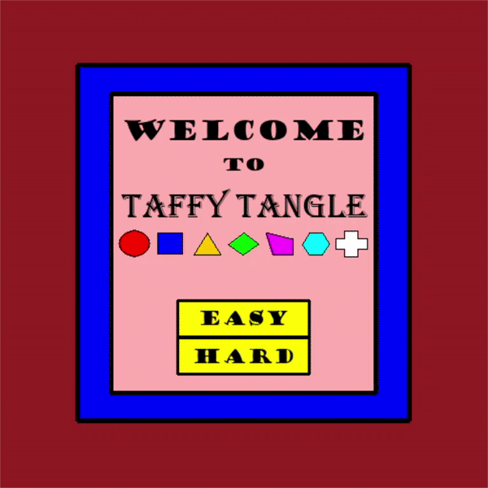

# TaffyTangle
A match three game made in Python for a first year assignment. It utilizes the moduels stddraw, stdio, and color from the Princeton Education Booksite. It includes two difficulties, and a hint button for when you are stuck. The difficulties each have a different number of game pieces and score targets. There is a move limit so if you do not reach the target score you lose. 

Also included is an auto player moduel, which upon you choosing the difficulty a game will commence where a computer player chooses and exectutes swaps. This works with the hint button but instead of displaying the hint, the module executes a swap. The hint button shows the first viable move it finds so the autoplayer is not very smart but occasionally wins. The auto player was handy when I needed to balance the difficulties and look for visual bugs that may have occured.

